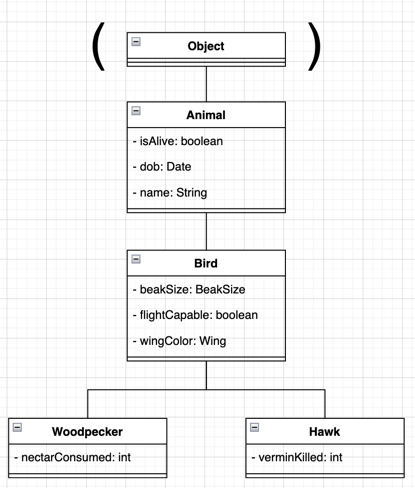
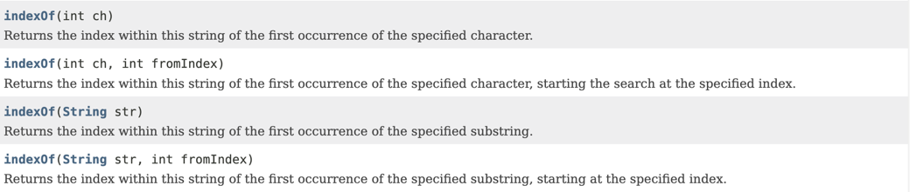
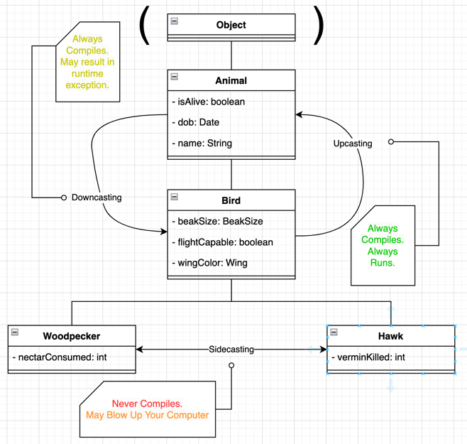

# Welcome!
If you're new to Git/GitHub, this is a README, and it's pretty self-explanatory. You read it. If anyone cares, these are typically written in Markdown, an open-source markup language that adds formatting to plaintext documents. [Here's the documentation if you want to learn more.](https://www.markdownguide.org/cheat-sheet/)

I'm gonna go ahead and say you'll get the most from this in an IDE. IntelliJ will probably be the easiest to set up out-of-the-box. If you have VSCode set up that works too.
- It may ask you to set up an SDK. Click the button and click one. I guess technically Java 11 is the right one for this course but it doesn't matter for this exercise.
- The "Search Everywhere" feature will be your bestie.

Lastly, this lab is intended to be a review. If any of the words Abstraction, Polymorphism, or Casting are new to you, close this page and figure those out first.
I'm not trying to be mean I just know this isn't good enough to teach it to you. 

Anyways... onto the lab. I was going to add the methods to the diagram, but I kept changing them so my bad.

***
## Abstraction and Abstract Classes
*The creation of well-defined classes and interfaces to hide well the complex inner workings from its users.*

### Abstract Classes
- `TODO: 1.1` In Main.java, declare (not instantiate) a Bird, an Animal, and a Hummingbird.
- `TODO: 1.2` In the `main()` method, try to instantiate the values created in the previous step by calling `new Animal()`, `new Bird()`, and `new Hummingbird()`
  - This step requires you (or your pair programmer) to dive into Oracle's documentation for Color and Date. Look for some static variables (like Integer's Integer.MAX_VALUE) to use to instantiate your Animal, Bird, and Hummingbird.
    - [Java.awt.Color](https://docs.oracle.com/javase/7/docs/api/java/awt/Color.html)
    - [Java.util.Date](https://docs.oracle.com/javase/8/docs/api/java/util/Date.html)
      - Not Java.sql.Date
  - If you use autocomplete, IntelliJ may give you a boilerplate of code, if you completed it, it technically works, but is not the point of this exercise, so ignore it please.

### Abstract Methods
- `TODO: 2.1` Declare an abstract method in Animal.java called makeNoise().
  - Ah! Some red squigglies have appeared! We must fix them!
  - `TODO: 2.2` Solution 1: Implement `makeNoise()` in the Bird class
    - Use this if you forgot what birds sound like `System.out.println("tweet tweet");`
    - Write some code to test what happens when we call makeNoise on both a Hummingbird and a Hawk.
  - `TODO: 2.3` Solution 2: Implement `makeNoise()` in both the HummingBird and Hawk classes.
    - Make something up if you don't know what those sound like
    - Write some code to test what happens when we call makeNoise on both a Hummingbird and a Hawk.
  - `TODO: 2.4` What would happen if you uncommented the implementation of makeNoise in Bird.java? Uncomment the code from `TODO 2.2` in Bird.java.

***
## Polymorphism
*Having many forms*
### Compile-Time Polymorphism
*The one you know as Method Over**loading**. AKA Static Polymorphism or Static Binding*
> **Static polymorphism** *From: https://www.geeksforgeeks.org/polymorphism-in-java/*
> 
> Method Overloading: When there are multiple functions with the same name but different parameters then these functions are said to be overloaded. Functions can be overloaded by changes in the number of arguments, a change in the type of arguments, and/or a change in the order of arguments.

Example: The `indexOf()` method of Java's `String` class. 

- `TODO: 3.1` Overload the `killVermin()` method in Hawk.java to take in an `int` for the number of vermin to kill.
  - `TODO: 3.2` Instantiate a Hawk, then call both implementations of `killVermin()` from Main.java

### Runtime Polymorphism
*The one you know as Method Over**riding**. AKA Dynamic Method Dispatch*

- `TODO: 4.1` In Main.java, call the `toString()` method of the Hummingbird we created in `TODO 1.2` and record the output
    - Which toString() will this call? Objects? Animals? Birds?
  - `TODO: 4.2` Override the `toString()` method in Hummingbird.java using the `super` keyword
    - Refer to Bird.java's toString() method if necessary.
  - `TODO: 4.3` Run your Main.java again and compare the output.
  - `TODO: 4.4` In Animal.java, add a super.toString() call to the output. What do you expect to happen when you run it again?
  - `TODO: 4.5` (Surprise!) Run your Main.java again and compare the output.

***
## Casting
- Casting allows us to convert a variable to another type.
  - Upcasting is done automatically (implicitly).
  - Downcasting is not done automatically (and must be done explicitly with parenthesis).

### Upcasting
*Casting a child object to a parent object. Always compiles, always runs. Can be done implicitly.*

- `TODO: 5.1` Create an Object with a Static type of Bird and Dynamic type of Hummingbird.
  - What methods can you call? What methods result in an error?

### Sidecasting
*Casting a sibling to a sibling. Never compiles, thus never runs*

- `TODO: 5.2` I mean hopefully we know what's going to happen here... *Try* to create an Object with a static type of Hawk and dynamic type of Hummingbird.

### Downcasting
*The tricky one. Casting a parent to a child. Always compiles, sometimes runs. Can **only** be done explicitly. (Using parenthesis)*

- `TODO 5.3` Explore downcasting.
  - What kind of error is thrown when we try to downcast implicitly?

[The rules of downcasting from GeeksForGeeks](https://www.geeksforgeeks.org/rules-of-downcasting-objects-in-java/?ref=rp)

- `TODO: 5.3` Explore downcasting in Main.java.

***
*Made for Elijah Nicpon's CS 1331 Exam 2 Double PLUS (Peer Led Undergraduate Study) Session*

*Star this repo if the lab helped! <3*